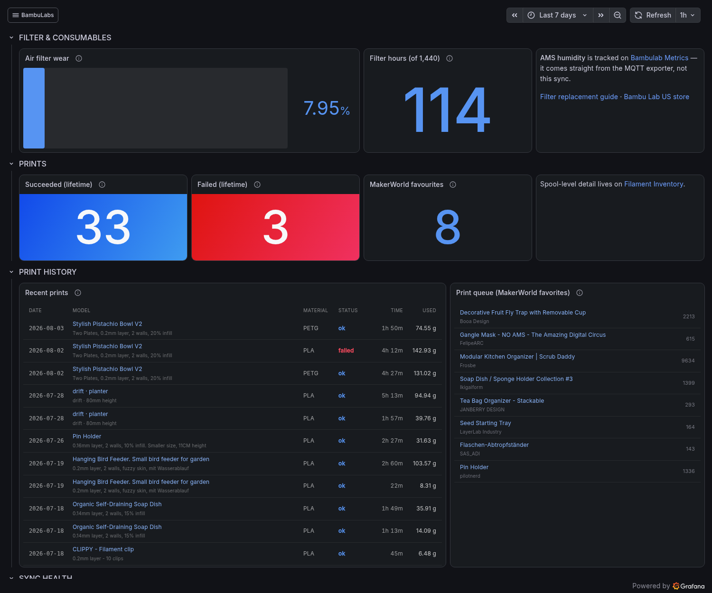
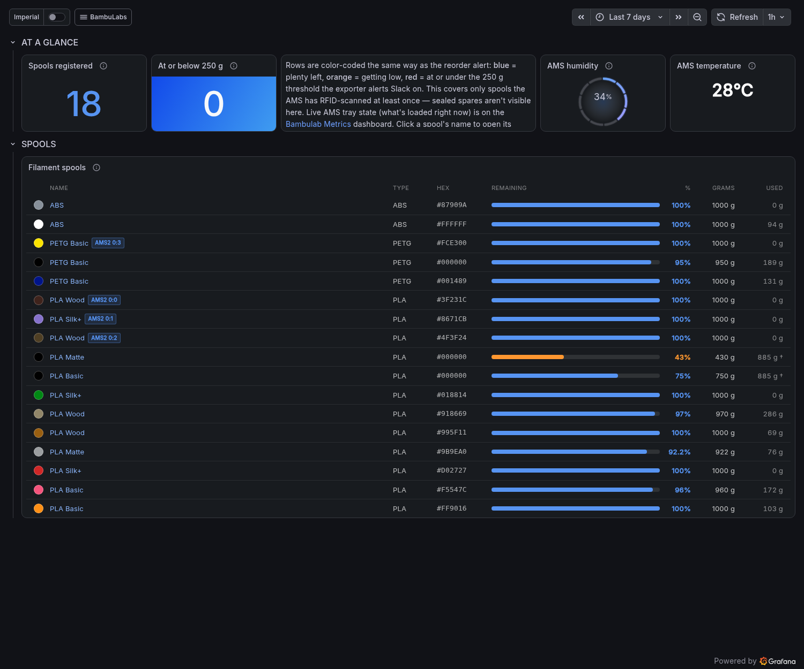

# bambu-sync

**A Prometheus exporter for the Bambu Lab Cloud API** — print history, RFID
filament inventory, and MakerWorld favourites — with Slack alerting for the
conditions worth acting on.

It is a **companion to a LAN MQTT exporter, not a replacement.** Those read the
*device*: temperatures, fans, print progress, live AMS state. This reads the
*account*: what you have printed, which spools exist and how full they are, and
what you have bookmarked. Same printer, different data source.

> **Unofficial API.** `api.bambulab.com` is reverse-engineered and undocumented.
> Bambu can change or break it without notice. This tool is **read-only** — it
> never starts a print and never touches the printer's queue. Field mappings
> here were confirmed against an X2D; other models may differ.

## Metrics

**Full reference: [docs/METRICS.md](docs/METRICS.md)** — every metric, its
labels, and the caveats that matter.

Naming convention: **`bambu_*` is the cloud plane** (this exporter, reading
your *account*). **`bambulab_*` is the device plane** (the LAN MQTT exporters,
reading the *printer*). They do not overlap and neither replaces the other.

| Group | |
| --- | --- |
| **Filament** | Per-spool remaining weight and percent, lifetime consumption, depleted flag |
| **Prints** | Recent prints with model, URL, slicer profile, duration and grams; success/failure counts; per-material aggregates |
| **Consumables** | Activated-carbon filter wear against its 1,440-hour interval |
| **Printer** | Identity and cloud-side online status |
| **MakerWorld** | Favourites, treated as a print queue |
| **Exporter health** | `up`, last-run, duration, build info, per-endpoint error counter, token expiry |

Three things are worth knowing before you build anything on these:

- **`bambu_spool_used_grams` is not always summable.** Print history reports
  only the broad material, never the variant, so two same-colour spools share
  one figure. It carries an `ambiguous` label saying so. Summing blindly
  reports 1,770 g from 885 g of filament.
- **Only RFID-registered spools appear.** Sealed spares the AMS has never
  scanned are invisible, so "nothing running low" means nothing low *among
  what has been loaded*.
- **`bambu_device_info`'s `product_name` is the only accurate model
  identification available** — MQTT exporters report an X2D as an X1C, because
  the LAN payload cannot express the difference.

## Dashboards

Two example dashboards in [`dashboards/`](dashboards/), ready to import.



**Maintenance & History** — filter wear, print history with duration and
slicer profile, MakerWorld queue, and sync health including token expiry.



**Filament Inventory** — registered spools with levels, reorder threshold,
lifetime usage, and which spool is in which AMS slot. AMS humidity and
temperature come from the MQTT exporter, not this one.

> **These are examples, not a maintained product.** Datasources are template
> variables, so set them on import. They are Grafana schema **v2**
> (`dashboard.grafana.app/v2`), which is recent — older Grafana will not import
> them directly. Adapt them; do not expect updates.

## Configuration

All configuration is environment variables; nothing site-specific is compiled
in. Secrets are read from **files**, not values, and re-read every cycle — so a
rotated Kubernetes Secret is picked up without a restart.

| Variable | Default | |
| --- | --- | --- |
| `BAMBU_TOKEN_FILE` | `/etc/bambu/token` | Bearer token |
| `BAMBU_TOKEN_EXPIRY_FILE` | `/etc/bambu/expires` | `YYYY-MM-DD`; see below |
| `BAMBU_API_BASE_URL` | `https://api.bambulab.com/v1` | The `/v1` is mandatory |
| `SLACK_ALERTS_ENABLED` | `false` | Explicit; ships disabled |
| `SLACK_WEBHOOK_FILE` | `/etc/bambu/slack-webhook` | Incoming webhook URL |
| `SLACK_USERNAME` / `SLACK_ICON_EMOJI` | `Bambu Sync` / `:printer:` | |
| `HUMIDITY_METRICS_URL` | *(unset — disabled)* | e.g. `http://bambulab-exporter:9109/metrics` |
| `HUMIDITY_METRIC_NAME` | `bambulab_ams_unit_humidity` | |
| `SYNC_DAILY_AT` | `07:00` | Local time, honours `TZ` across DST |
| `SYNC_FAST_INTERVAL` | `30m` | Current-print refresh |
| `SYNC_FULL_INTERVAL` | `24h` | Fallback cadence — see below |
| `BAMBU_STORE_URL` | `https://us.store.bambulab.com` | Regional storefront for product links |
| `HISTORY_LIMIT` | `100` | Prints **fetched**; aggregates span all of them |
| `LOW_GRAMS` | `250` | Reorder threshold |
| `HUMIDITY_WARN` / `HUMIDITY_CRIT` | `30` / `45` | % RH |
| `FILTER_INTERVAL_HOURS` | `1440` | |
| `TOKEN_WARN_DAYS` | `14` | Warn this far ahead of expiry |
| `FAVORITES_LIMIT` / `PRINT_INFO_LIMIT` | `25` / `20` | Cardinality caps |
| `LISTEN_ADDR` | `:9110` | |
| `ENABLE_PPROF` | `false` | Serve `/debug/pprof` — **opt-in**, see below |
| `TZ` | `UTC` | |

Humidity thresholds sit deliberately **above** Bambu's stated <20% RH target:
the AMS reads ~21% in normal operation, so alerting at 20% would fire daily for
a condition that is fine.

`FAVORITES_LIMIT` and `PRINT_INFO_LIMIT` are cardinality caps, not display
limits. Every entry is a distinct label set and both lists only grow.

`HISTORY_LIMIT` is a different thing again: it is how many prints are
**fetched**, and the per-material aggregates run over all of them. That is how
the detail `PRINT_INFO_LIMIT` discards is recovered without a second API call
— so lowering it silently shrinks every total while the exposition still looks
healthy. Keep it well above `PRINT_INFO_LIMIT` or the aggregates tell you
nothing the capped list does not already show.

> `SYNC_FULL_INTERVAL` is currently **unreachable**. It is the fallback used
> when `SYNC_DAILY_AT` cannot be parsed, but startup rejects an unparseable
> value outright, so the process never reaches the fallback. Documented
> because the code honours it, not because it does anything today.

## Authentication

There is no API-key page in Bambu's UI. You log in as yourself and keep the
bearer token it hands back.

```sh
curl -sS -X POST https://api.bambulab.com/v1/user-service/user/login \
  -H 'Content-Type: application/json' \
  -d '{"account":"you@example.com","password":"..."}'
```

Most accounts get `{"loginType":"verifyCode"}` and an **emailed code** rather
than a token. Send it back with the code and no password:

```sh
curl -sS -X POST https://api.bambulab.com/v1/user-service/user/login \
  -H 'Content-Type: application/json' \
  -d '{"account":"you@example.com","code":"123456"}'
```

The response carries `accessToken` and `expiresIn` (seconds, ~3 months). Write
the token to your token file, and **today + `expiresIn`** as `YYYY-MM-DD` to
the expiry file.

> Mind your shell history with a password on the command line — use a heredoc
> or a file, not an inline `-d`, if that matters to you.

The token is an **opaque bearer string, not a JWT** — its expiry cannot be
decoded from it. That is the whole reason the expiry date is configured
separately.

There is **no working refresh endpoint**. Re-authentication is manual and
interactive: email, password, and an emailed 2FA code. When you re-auth,
**update both the token and its expiry date** — updating only the token leaves
the exporter warning against a stale date.

## Running

Secrets are read from **files**, not environment variables, and re-read every
cycle — so rotating a token does not need a restart. Three files, one per
secret; `slack-webhook` is only needed with alerting on.

```sh
mkdir -p ./secrets
printf '%s' 'YOUR_TOKEN'  > ./secrets/token
printf '%s' '2026-10-30'  > ./secrets/expires
```

### From source

Go 1.26+. No cgo, no build tags.

```sh
go build -o bambu-sync ./cmd/bambu-sync
BAMBU_TOKEN_FILE=./secrets/token BAMBU_TOKEN_EXPIRY_FILE=./secrets/expires ./bambu-sync
```

```sh
# Single sync, exposition text to stdout, no server. Good for a first run,
# and for diffing against whatever you are replacing.
BAMBU_TOKEN_FILE=./secrets/token BAMBU_TOKEN_EXPIRY_FILE=./secrets/expires ./bambu-sync -once
```

### Docker

```sh
docker run --rm -p 9110:9110 \
  -v "$PWD/secrets:/etc/bambu:ro" \
  -e TZ=America/Chicago \
  ghcr.io/chewrocca/bambu-sync:latest
```

Images are published for `linux/amd64` and `linux/arm64`, so this runs on a
Raspberry Pi as-is.

### docker-compose

```yaml
services:
  bambu-sync:
    image: ghcr.io/chewrocca/bambu-sync:latest
    restart: unless-stopped
    ports: ["9110:9110"]
    volumes:
      - ./secrets:/etc/bambu:ro
    environment:
      TZ: America/Chicago
      SYNC_DAILY_AT: "07:00"
      # Optional: read AMS humidity from a LAN MQTT exporter, if you run one.
      # HUMIDITY_METRICS_URL: http://bambulab-exporter:9109/metrics
      # SLACK_ALERTS_ENABLED: "true"
```

Then point Prometheus at `bambu-sync:9110`.

### Kubernetes

[`deploy/example.yaml`](deploy/example.yaml) has a Deployment, a Service with
scrape annotations, and a stub Secret:

```sh
kubectl apply -f deploy/example.yaml
```

Adapt the Secret to whatever you already use — External Secrets, Sealed
Secrets, SOPS. The only requirement is that the values arrive as **files**.

### Logs

JSON on stdout. Each completed run emits one record tagged
`"event":"run_summary"`; everything else is the surrounding trace. In Loki:

```
{namespace="bambu"} | json | event="run_summary"
```

## Profiling

`ENABLE_PPROF=true` serves Go's standard `/debug/pprof` handlers on the same
port as `/metrics`, so a Pyroscope scraper (or `go tool pprof`) can reach them.

> **Off by default, deliberately.** Those handlers expose goroutine stacks,
> heap contents and the process command line, and this binary holds a
> full-account bearer token. Enable it on a cluster-internal Service, not on
> anything reachable from outside.

For Grafana Alloy's `pyroscope.scrape`, annotate the pod:

```yaml
metadata:
  annotations:
    pyroscope.grafana.com/scrape: "true"
    pyroscope.grafana.com/port: "9110"
```

**Be honest about the value before you turn it on.** This service is idle
almost all of the time — a handful of HTTP calls a day and two tickers. CPU
profiles will be flat. What profiling is genuinely good for here is diagnosing
a goroutine or memory leak in a long-running process *after* the Go collector's
`go_goroutines` or `go_memstats_*` (exported by default) tell you one exists.
Metrics find the problem; pprof explains it.

## Alerting

Silent by default: alerts fire only when something is actionable — filament
low, AMS humid, a new failed print, the filter due, or the token expiring.

Two behaviours worth knowing:

- **Alerts are evaluated only on the scheduled daily run**, never on startup or
  the fast poll. Most conditions are *standing* — a spool at 200 g is low on
  every run until you swap it — so alerting on every cycle would re-ping on
  every restart.
- **The failed-print baseline is in memory** and is seeded on the first run
  after start *without* alerting, so a restart is silent rather than replaying
  history.

## Licence

MIT. See [LICENSE](LICENSE).

Field mappings were derived from observation and from the community
reverse-engineering notes at
[Doridian/OpenBambuAPI](https://github.com/Doridian/OpenBambuAPI). No code was
taken from other Bambu projects.
